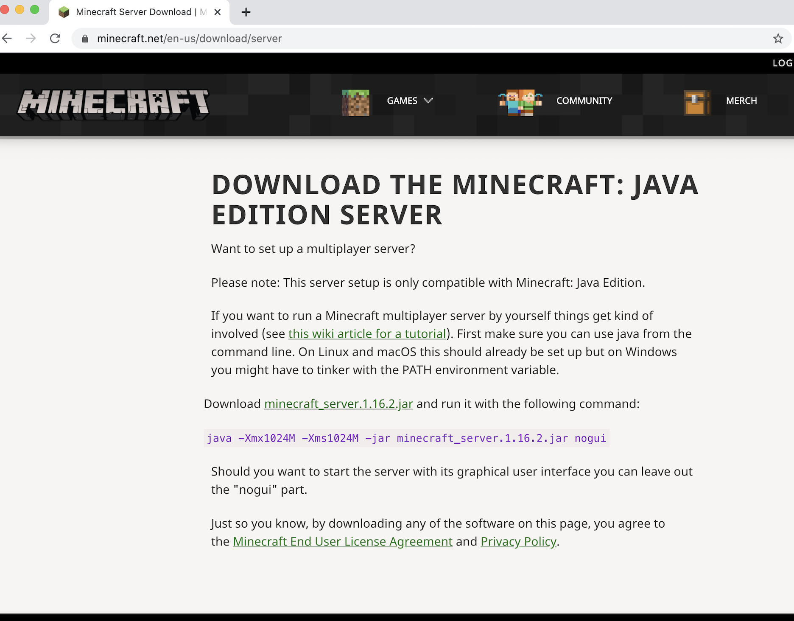

# bukkitplugins

Here are a number of plugins that allow players to fly, eat, throw grenades, plant flower bombs, etc in the survival mode of Minecraft.  Each folder has the source code all in one folder for easy readability. 
All you have to do it download the jar file of your choice, and drop it into the plugins folder of your own server.  
Finally to run the spigot server, the instructions are in the run txt file.  

+-----------------------------------------------------+

Plugins are software add-on that are installed on a program to enhance its capabilities without changing the program itself. 

These plugins are written in Java and uses the Bukkit API, which is an API that provides anyone with the ability to add their own code to Minecraft Java version. 
It then uses spigot as a build path as well as using their servers to run the game.  These specific plugins are optimized for Minecraft version 14. 

+-----------------------------------------------------+

To run your own server just download the java minecraft package here:

https://www.minecraft.net/en-us/download/server/

Then download your preferred version of spigot: 

https://getbukkit.org/download/spigot

Then drag your spigot file in the folder and opening it it should look like this.  And as you can see just drag the plugins to the plugin folder.  (Make sure to change false to true on the eula.txt file) 

Finally enjoy!

***
All code was written in eclipse version 4.14.0 using Java SE 9
***

